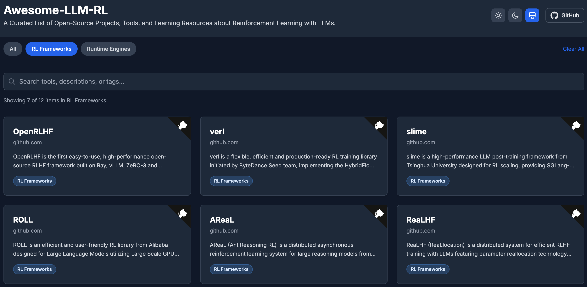

# Awesome-LLM-RL

Una lista curada de proyectos de código abierto, herramientas y recursos de aprendizaje sobre Aprendizaje por Refuerzo (Reinforcement Learning) con LLMs.

🌐 **Sitio Web**: [https://0xWelt.github.io/Awesome-LLM-RL/](https://0xWelt.github.io/Awesome-LLM-RL/)

## Índice

- [Índice](#table-of-contents)
- [Frameworks de RL](#rl-frameworks)
  - [OpenRLHF](#openrlhf)
  - [verl](#verl)
  - [slime](#slime)
  - [ROLL](#roll)
  - [AReaL](#areal)
  - [ReaLHF](#realhf)
  - [Safe-RLHF](#safe-rlhf)
- [Motores de Ejecución (Runtime)](#runtime-engines)
  - [Motores de Inferencia](#inference-engines)
    - [vLLM](#vllm)
    - [SGLang](#sglang)
  - [Motores de Entrenamiento](#training-engines)
    - [Megatron-LM](#megatron-lm)
    - [DeepSpeed](#deepspeed)
    - [PyTorch FSDP](#pytorch-fsdp)
- [Estado del Repositorio](#repo-status)
- [Colaboradores](#contributors)
- [Historial de Estrellas](#star-history)
- [Licencia](#license)

## Frameworks de RL

> Frameworks de aprendizaje por refuerzo para el entrenamiento y evaluación de LLMs.

### [OpenRLHF](https://github.com/OpenRLHF/OpenRLHF)

OpenRLHF es el primer framework de RLHF de código abierto, fácil de usar y de alto rendimiento construido sobre Ray, vLLM, ZeRO-3 y HuggingFace Transformers, diseñado para hacer que el entrenamiento de RLHF sea sencillo y accesible. Aprovecha Ray para una programación distribuida eficiente, separando los modelos Actor, Reward, Reference y Critic en diferentes GPUs para permitir un entrenamiento escalable para modelos de hasta más de 70B de parámetros. Impulsado por vLLM y Auto Tensor Parallelism, ofrece una generación de muestras de alto rendimiento y eficiente en memoria que reduce el 80% del tiempo de entrenamiento de RLHF dedicado a la generación de muestras. Basado en ZeRO-3 y AutoTP de DeepSpeed, permite el entrenamiento de modelos grandes sin frameworks pesados, manteniendo una integración fluida con HuggingFace. Soporta algoritmos de RL exhaustivos, incluidos PPO, REINFORCE++, GRPO, RLOO y Dr. GRPO, junto con funciones avanzadas como programación de Hybrid Engine, entrenamiento asíncrono, RLHF basado en agentes, optimización DPO/KTO y soporte multimodal.

### [verl](https://github.com/volcengine/verl)

verl es una librería de entrenamiento de RL flexible, eficiente y lista para producción iniciada por el equipo de ByteDance Seed, que implementa el framework HybridFlow para modelos de lenguaje grandes. Basado en un modelo de programación de controlador híbrido, permite la representación flexible y la ejecución eficiente de flujos de datos complejos de post-entrenamiento, soportando diversos algoritmos de RL como PPO, GRPO, GSPO, ReMax, REINFORCE++, RLOO, PRIME, DAPO y DrGRPO. Integrándose a la perfección con la infraestructura de LLM existente a través de APIs modulares, verl soporta FSDP, FSDP2, Megatron-LM para el entrenamiento y vLLM, SGLang, HF Transformers para la generación de rollouts. Cuenta con 3D-HybridEngine para un resharding eficiente del modelo actor, soporte de RL multimodal para modelos de visión-lenguaje, entrenamiento de agentes multivuelta con llamada a herramientas y escalabilidad hasta modelos de 671B con paralelismo de expertos. Compatible con Hugging Face Transformers y Modelscope Hub, verl impulsa modelos de razonamiento vanguardistas como Seed-Thinking-v1.5 y permite investigaciones disruptivas, incluyendo DAPO alcanzando 50 puntos en AIME 2024.

### [slime](https://github.com/THUDM/slime)

slime es un framework de post-entrenamiento de LLM de alto rendimiento de la Universidad de Tsinghua diseñado para el escalado de RL, proporcionando una integración nativa de SGLang con Megatron-LM para un entrenamiento eficiente y flujos de trabajo de generación de datos flexibles. Construido sobre una arquitectura modular con componentes de entrenamiento (Megatron), rollout (SGLang + router) y búfer de datos, permite una sincronización de parámetros y gestión de datos sin interrupciones. Soporta modelos densos como GLM-4-9B y Qwen3-4B, modelos MoE incluyendo GLM-4.5, Qwen3-30B-A3B y DeepSeek-R1, así como entrenamiento de agentes multivuelta con capacidades de llamada a herramientas. Cuenta con conversión de formato de checkpoints entre Hugging Face y formatos torch_dist de Megatron, entrenamiento distribuido basado en Ray y ejemplos exhaustivos para tareas de razonamiento, codificación y búsqueda. slime impulsa el entrenamiento de GLM-4.5 y proporciona soluciones listas para producción para post-entrenamiento de RL a gran escala con configuraciones de hasta 128xH100 GPUs.

### [ROLL](https://github.com/alibaba/ROLL)

ROLL es una librería de RL eficiente y fácil de usar de Alibaba diseñada para modelos de lenguaje grandes que utilizan recursos de GPU a gran escala, mejorando significativamente el rendimiento de los LLM en la alineación con las preferencias humanas, el razonamiento complejo y los escenarios de interacción agéntica multivuelta. Aprovechando una arquitectura distribuida de múltiples roles con Ray para la asignación flexible de recursos y la programación de tareas heterogéneas, ROLL integra tecnologías punteras como Megatron-Core, SGLang y vLLM para acelerar el entrenamiento y la inferencia de modelos. Soporta entrenamiento de RL multitarea (RLVR) que cubre matemáticas, codificación, razonamiento general y RL agéntico para interacciones multivuelta, juegos y uso de herramientas. Cuenta con más de 20 configuraciones ricas de estrategia de RL, rollout paralelo asíncrono a nivel de muestra, rollout paralelo asíncrono a nivel de entorno y soporte exhaustivo de algoritmos incluyendo PPO, GRPO, Reinforce++, TOPR, RAFT++, GSPO, GiGPO y StarPO. Con AutoDeviceMapping para mapeo de dispositivos personalizado, capacidades extremas de offload/reload, soporte de entrenamiento LoRA e observabilidad integrada con SwanLab, WandB y TensorBoard.

### [AReaL](https://github.com/inclusionAI/AReaL)

AReaL (Ant Reasoning RL) es un sistema de aprendizaje por refuerzo asíncrono distribuido para modelos de razonamiento grandes de Ant Research, construido sobre ReaLHF para un entrenamiento de RL totalmente asíncrono con una aceleración de 2.77x sobre los sistemas síncronos. Cuenta con AReaL-lite, una base de código ligera centrada en el algoritmo con un 80% menos de líneas mientras mantiene el 90% del rendimiento, soportando un entrenamiento escalable desde un solo nodo hasta más de 1K GPUs. Proporciona algoritmos de RL exhaustivos incluyendo PPO, GRPO, REINFORCE++ y RL agéntico multivuelta con capacidades de llamada a herramientas. Impulsa modelos de razonamiento vanguardistas con un rendimiento puntero en tareas de matemáticas y codificación, ofreciendo reproducibilidad completa con el código, los conjuntos de datos y las recetas de entrenamiento publicados.

### [ReaLHF](https://github.com/openpsi-project/ReaLHF)

ReaLHF (ReaLlocation) es un sistema distribuido para el entrenamiento eficiente de RLHF con LLMs que presenta tecnología de reasignación de parámetros que redistribuye dinámicamente los parámetros del modelo a través de clusters. Logra un rendimiento de entrenamiento de PPO vanguardista a través de estrategias de paralelización adaptativa, soportando generación de alto rendimiento con CUDAGraph y paralelismo 3D. Proporciona algoritmos de RLHF exhaustivos incluyendo PPO, GRPO, DPO y RAFT con integración fluida con HuggingFace. Nota: Este proyecto ha sido archivado y el desarrollo continúa en [AReaL](https://github.com/inclusionAI/AReaL).

### [Safe-RLHF](https://github.com/PKU-Alignment/safe-rlhf)

Safe-RLHF es el primer framework para la alineación de valores restringida mediante aprendizaje por refuerzo seguro a partir de la retroalimentación humana, desarrollado por PKU-Alignment en la Universidad de Pekín. Presenta la metodología Safe RLHF que incorpora restricciones de seguridad durante el entrenamiento a través de modelos de recompensa y costo, proporcionando más de 1M de pares de preferencias etiquetados por humanos tanto para la utilidad como para la inocuidad. Soporta el flujo completo desde SFT hasta RLHF con evaluación de seguridad, incluyendo modelos Beaver preentrenados, checkpoints de modelos de recompensa/costo y métricas de seguridad exhaustivas en más de 10 dimensiones de daño. Ofrece una integración fluida con modelos LLaMA, OPT, Baichuan y soporte para el idioma chino.

## Motores de Ejecución (Runtime)

> Motores de ejecución para ejecutar y gestionar sistemas de aprendizaje por refuerzo basados en LLM.

### Motores de Inferencia

> Motores especializados para una inferencia eficiente de LLM durante el entrenamiento de RL y el despliegue.

#### [vLLM](https://github.com/vllm-project/vllm)

vLLM es un motor de inferencia y servicio de alto rendimiento y eficiente en memoria para LLMs que ofrece un rendimiento de servicio vanguardista a través de la gestión de memoria PagedAttention, procesamiento por lotes continuo (continuous batching) y kernels de CUDA optimizados. Soporta una integración fluida con modelos de Hugging Face, ofrece APIs compatibles con OpenAI y proporciona un soporte exhaustivo de cuantización (GPTQ, AWQ, INT4/8, FP8) junto con capacidades de inferencia distribuida en hardware de NVIDIA, AMD, Intel y TPU. Originalmente desarrollado en el Sky Computing Lab de UC Berkeley, vLLM ahora funciona como un proyecto impulsado por la comunidad que alimenta plataformas principales como LMSYS Vicuna y Chatbot Arena.

#### [SGLang](https://github.com/sgl-project/sglang)

SGLang es un framework de servicio rápido para modelos de lenguaje grandes y modelos de lenguaje de visión que co-diseña el runtime del backend y el lenguaje del frontend para aplicaciones de LLM de alto rendimiento. Cuenta con RadixAttention para el almacenamiento en caché de prefijos, un planificador de CPU sin sobrecarga, desagregación de prefill-decode, decodificación especulativa y procesamiento por lotes continuo, mientras proporciona un frontend pythonico para llamadas de generación encadenadas, prompting avanzado, flujo de control y entradas multimodales. Soporta extensas familias de modelos (Llama, Qwen, DeepSeek, GPT, Gemma, etc.) y está desplegado a escala masiva en más de 1M de GPUs en todo el mundo; SGLang impulsa billones de tokens diariamente para empresas líderes incluyendo xAI, AMD, NVIDIA, Google Cloud y Microsoft Azure.

### Motores de Entrenamiento

> Motores de entrenamiento de alto rendimiento optimizados para RL con modelos de lenguaje grandes.

#### [Megatron-LM](https://github.com/NVIDIA/Megatron-LM)

Megatron-LM es la librería de NVIDIA optimizada para GPU para entrenar modelos transformer a escala, proporcionando capacidades de entrenamiento distribuido vanguardistas con estrategias de paralelismo exhaustivas que incluyen paralelismo de tensor, pipeline, datos, contexto y expertos. Cuenta con Megatron Core como una librería componible con bloques de construcción optimizados, soportando modelos desde 2B hasta más de 462B de parámetros a través de miles de GPUs con hasta un 47% de Utilización de FLOPs del Modelo. Soporta amplias arquitecturas de modelos (LLaMA, GPT, DeepSeek, Qwen, Mixtral, Mamba) con funciones avanzadas como entrenamiento FP8, FlashAttention, checkpointing de activación y entrenamiento tolerante a fallos; Megatron-LM impulsa el entrenamiento a escala de producción para empresas e instituciones de investigación líderes en todo el mundo.

#### [DeepSpeed](https://github.com/deepspeedai/DeepSpeed)

DeepSpeed es la librería de optimización de aprendizaje profundo de Microsoft que revoluciona el entrenamiento y la inferencia distribuidos a través de cuatro pilares de innovación: entrenamiento, inferencia, compresión y aplicaciones científicas. Cuenta con la innovadora tecnología ZeRO (Zero Redundancy Optimizer) para la optimización de memoria, permitiendo el entrenamiento de modelos de billones de parámetros con ZeRO-Infinity, ZeRO-Offload y ZeRO++ para escalas extremas. Soporta paralelismo 3D (datos, tensor, pipeline), DeepSpeed-MoE para mezcla de expertos y técnicas de compresión avanzadas; ha impulsado modelos récord mundiales como Megatron-Turing NLG 530B, BLOOM 176B y Jurassic-1 178B. Con una integración fluida en PyTorch, Transformers, Lightning y Azure, DeepSpeed ofrece una aceleración de 15x para el entrenamiento de RLHF tipo ChatGPT y una reducción de costos sin precedentes en todas las escalas.

#### [PyTorch FSDP](https://pytorch.org/tutorials/intermediate/FSDP_tutorial.html)

PyTorch Fully Sharded Data Parallel (FSDP) es un motor de entrenamiento distribuido eficiente en memoria que fragmenta (shards) los parámetros del modelo, los gradientes y los estados del optimizador a través de las GPUs para permitir el entrenamiento de modelos grandes que no caben en un solo dispositivo. FSDP2 representa una evolución importante con fragmentación basada en DTensor para una manipulación sencilla de parámetros, una mejor gestión de memoria con uso determinista de GPU y políticas flexibles de precisión mixta que soportan computación bfloat16 con reducción de gradientes float32. Ofrece prefetch implícito y explícito para solapar la comunicación con la computación, soporta inicialización de meta-dispositivo para modelos grandes y proporciona una integración fluida con los optimizadores de PyTorch y el recorte de gradientes (gradient clipping). Con extensiones de subclase de tensor para cuantización float8 y NF4, FSDP permite el entrenamiento eficiente de modelos de miles de millones de parámetros manteniendo la compatibilidad total con el ecosistema de PyTorch.

## Estado del Repositorio

## Colaboradores

Este proyecto existe gracias a todas las personas que colaboran.

## Historial de Estrellas

## Licencia

Este trabajo está licenciado bajo una [Licencia Internacional Creative Commons Attribution 4.0](http://creativecommons.org/licenses/by/4.0/).
